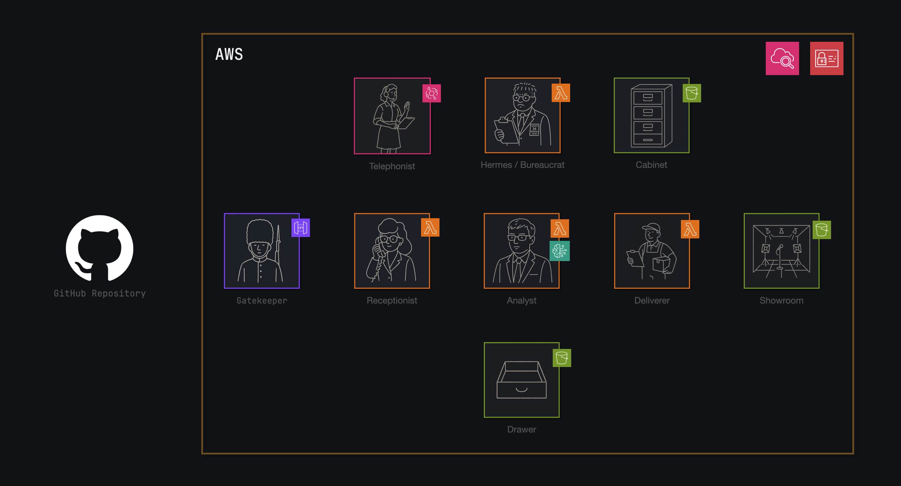

# CodeRipple

**Documentation that evolves with your code, automatically.**

CodeRipple is a serverless automated code analysis system that generates comprehensive documentation and insights through GitHub webhooks. When code is committed, the system automatically clones the repository, performs AI-powered analysis using Strands and Claude 3.5 Sonnet, and delivers results via a professional web interface.



## 🚀 Quick Start

### 1. Set up GitHub Webhook

Add a webhook to your GitHub repository:

- **Payload URL:** `https://1dx8rzw03f.execute-api.us-east-1.amazonaws.com/prod/webhook`
- **Content type:** `application/json`
- **Events:** Just the push event
- **Active:** ✅ Checked

### 2. Push Code

```bash
git add .
git commit -m "Trigger CodeRipple analysis"
git push
```

### 3. View Results

Your analysis will be available within minutes at:
**🌐 [CodeRipple Showroom](http://coderipple-showroom.s3-website-us-east-1.amazonaws.com/)**

## ✨ Features

- **🤖 AI-Powered Analysis** - Real code analysis using Strands framework with Claude 3.5 Sonnet
- **📊 Comprehensive Documentation** - Automatic generation of architecture docs, getting started guides, and code insights
- **🔄 Automated Pipeline** - Triggered by GitHub webhooks, no manual intervention required
- **🌐 Professional Delivery** - Clean web interface with direct download capabilities
- **📈 Event Monitoring** - Complete system observability and logging
- **💰 Cost Effective** - Serverless architecture, pay only for usage (typically <$3/month)

## 🏗️ Architecture

CodeRipple uses a professional team metaphor with specialized AWS services:

### Core Components

- **🚪 Gatekeeper** (API Gateway) - Webhook endpoint security and validation
- **👋 Receptionist** (Lambda) - Webhook processing and repository cloning
- **📞 Telephonist** (EventBridge) - Event routing and coordination
- **🔬 Analyst** (Lambda) - AI-powered code analysis using Strands + Claude 3.5 Sonnet
- **🗄️ Drawer** (S3 Private) - Private document storage and retrieval
- **🚚 Deliverer** (Lambda) - Analysis results packaging and delivery
- **🏪 Showroom** (S3 Public) - Public documentation delivery via website
- **📋 Hermes** (Lambda) - Event logging and status tracking
- **🗃️ Cabinet** (S3 Public) - Public event logs and pipeline monitoring

### Event Flow

```
GitHub Webhook → Gatekeeper → Receptionist → Telephonist
                                    ↓
Drawer ← Repository Clone    EventBridge → Analyst
  ↓                                         ↓
Analysis Storage ← AI Analysis ← Strands + Claude 3.5
  ↓
Deliverer → Package Results → Showroom → Public Website
  ↓
Hermes → Event Logging → Cabinet → System Monitoring
```

## 🛠️ Technology Stack

- **AWS Lambda** - Serverless compute (Python 3.12)
- **AWS EventBridge** - Event routing and service coordination
- **AWS S3** - Repository storage and public website hosting
- **AWS API Gateway** - GitHub webhook endpoint
- **AWS Bedrock + Strands + Claude 3.5 Sonnet** - Real AI-powered code analysis
- **Docsify** - Documentation website framework
- **GitHub API** - Repository operations and webhook processing

## 📦 Deployment

CodeRipple is designed for easy deployment with individual component scripts:

### Prerequisites

- AWS CLI configured with appropriate permissions
- Python 3.12+
- Bash shell environment

### Core Infrastructure

```bash
# 1. Deploy API Gateway webhook endpoint
cd api_gatekeeper && ./deploy.sh

# 2. Deploy EventBridge event routing
cd eventbridge_telephonist && ./deploy.sh

# 3. Deploy event logging system
cd lambda_hermes && ./deploy.sh
cd s3_cabinet && ./deploy.sh

# 4. Deploy repository storage
cd s3_drawer && ./deploy-bucket.sh

# 5. Deploy repository processor
cd lambda_receptionist && ./deploy.sh
```

### Analysis Engine

```bash
# Deploy AI analysis engine with Lambda Layers
cd lambda_analyst

# 1. Deploy Strands dependencies layer (60MB)
./deploy-layer-s3.sh

# 2. Deploy analysis function with layer
./deploy-with-layer.sh
```

### Results Delivery

```bash
# 1. Deploy public website
cd s3_showroom && ./deploy.sh

# 2. Deploy results packaging system
cd lambda_deliverer && ./deploy.sh
```

### Integration

Each deployment script:
- Creates necessary IAM roles and policies
- Configures AWS services with proper settings
- Sets up EventBridge triggers and targets
- Provides deployment verification and testing
- Saves deployment artifacts for integration

## 💡 Key Innovations

### Lambda Layers for Large Dependencies
CodeRipple solves the challenge of deploying large AI dependencies (173MB) in AWS Lambda through a sophisticated layer architecture:

- **Strands Dependencies**: 60MB layer with platform-targeted installation
- **Function Code**: Lightweight 33KB deployment package
- **Cross-Platform Compatibility**: macOS ARM64 development → Linux x86_64 production

### Shared Assets Architecture
Consistent branding and maintainability across multiple S3 websites:

- **Shared CSS/Images/Fonts**: Single source of truth for branding
- **Template System**: Parameterized HTML generation
- **Multi-Site Deployment**: Showroom and Cabinet with consistent styling

### Event-Driven Architecture
Complete observability and coordination through EventBridge:

- **Component Task Logging**: Every operation tracked and logged
- **Event Routing**: Decoupled service communication
- **Error Handling**: Comprehensive retry and dead letter queue strategies

## 🔍 Monitoring

### System Observability
- **Cabinet Website**: [http://coderipple-cabinet.s3-website-us-east-1.amazonaws.com](http://coderipple-cabinet.s3-website-us-east-1.amazonaws.com)
- **Event Logs**: Complete pipeline event tracking
- **Component Status**: Real-time system health monitoring
- **Performance Metrics**: Execution times and success rates

### CloudWatch Integration
- Lambda function metrics and logs
- S3 bucket access patterns
- EventBridge event volumes
- API Gateway request tracking

## 🧪 Sample Analyses

CodeRipple includes 12 professional sample analyses showcasing AI capabilities:

- **amazon-ecs-agent** - Container orchestration analysis
- **aws-cdk** - Infrastructure as code documentation
- **django** - Web framework architecture insights
- **react** - Frontend library analysis
- **linux** - Kernel code analysis
- **And 7 more...**

View samples at: [CodeRipple Showroom](http://coderipple-showroom.s3-website-us-east-1.amazonaws.com/)

## 📚 Documentation

### Development Documentation
- **[Development Log](dev_log/)** - Complete development history using Micromanaged Driven Development (MDD)
- **[Architecture Decisions](ARCHITECTURE_DECISIONS.md)** - Key technical decisions and rationale
- **[Cost Analysis](COST.md)** - Detailed cost breakdown and optimization strategies
- **[TODO](TODO.md)** - Future improvements and known limitations

### Component Documentation
Each component includes detailed README files with:
- Deployment instructions
- Configuration options
- Testing procedures
- Integration points

## 🤝 Contributing

CodeRipple follows Micromanaged Driven Development (MDD) with systematic documentation:

1. **Fork the repository**
2. **Create feature branch** following MDD unit structure
3. **Document implementation** in `dev_log/` directory
4. **Test thoroughly** with deployment scripts
5. **Submit pull request** with comprehensive documentation

## 📄 License

This project is licensed under the MIT License - see the [LICENSE](LICENSE) file for details.

## 🙏 Acknowledgments

- **Strands Framework** - AI-powered code analysis engine
- **AWS Serverless** - Scalable cloud infrastructure
- **Claude 3.5 Sonnet** - Advanced language model for code analysis
- **Docsify** - Documentation website framework

---

**CodeRipple** - Documentation that evolves with your code, automatically.

🌐 **Live Demo**: [CodeRipple Showroom](http://coderipple-showroom.s3-website-us-east-1.amazonaws.com/)  

